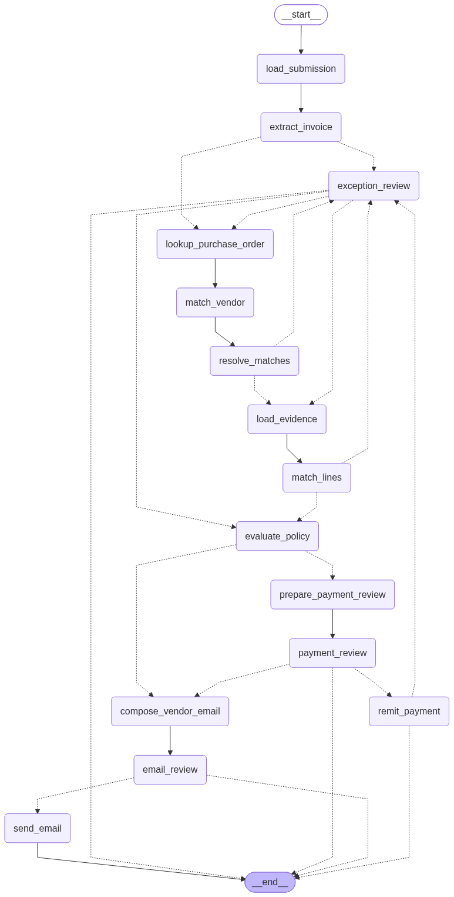

# Focused Agent

A runnable PO/invoice reconciliation agent. Uploading an invoice
creates a durable reconciliation case and queues it for a separate worker. The
dashboard shows the extracted evidence, matches, discrepancies, checkpoint history, and
human approval tasks.



## Local stack

Requirements: Docker with Compose and an OpenAI API key. Model access is exclusively
through LangChain's `ChatOpenAI` and embeddings adapters; the application does not
call a provider SDK directly.

```bash
cp .env.example .env
# Set OPENAI_API_KEY in .env.
# Optionally set LANGSMITH_API_KEY
docker compose up --build
```

Open:

- Dashboard: <http://localhost:3000/invoices>
- Captured email: <http://localhost:8025>
- MinIO console: <http://localhost:9001>
- Readiness: <http://localhost:3000/api/health>

Compose starts pgvector Postgres, MinIO, Mailpit, an idempotent setup/migration/seed
job, the reconciliation worker, and the web app. The demo seed includes a checked-in,
pre-generated semantic index for its purchase orders, so setup does not call the
embedding API. `OPENAI_API_KEY` is still required to process invoices and embed live
semantic-search queries. Readiness is HTTP 200 only when Postgres, pgvector, object
storage, SMTP, and agent configuration are healthy. Worker process health is owned
by the container runtime rather than the web app.

To stop without deleting data:

```bash
docker compose down
```

To intentionally delete the named local volumes as well:

```bash
docker compose down --volumes
```

The checked-in domain migration is a resettable demo baseline. After pulling a
baseline schema change, recreate the local volumes before running setup again.

## Host-based development

Use Node.js 24 and pnpm:

```bash
cp .env.example .env
# Set OPENAI_API_KEY in .env.
docker compose up -d db minio mailpit
pnpm install
pnpm db:setup
pnpm dev
```

Run the durable worker in another terminal:

```bash
pnpm agent:worker
```

`pnpm db:setup` enables pgvector, installs LangGraph's checkpoint schema, applies
the checked-in Drizzle migration, installs or upgrades pg-boss's separately managed
schema, configures the reconciliation and dead-letter queues, ensures the invoice
bucket exists, and optionally seeds demo accounting data together with its checked-in
PO embeddings. Each step is idempotent. Purchase orders added outside the demo seed
can be indexed or refreshed explicitly:

```bash
pnpm accounting:index-purchase-orders
```

When the canonical demo PO data or embedding contract changes, regenerate and commit
the seed artifact:

```bash
pnpm accounting:generate-seed-embeddings
```

Generation requires `OPENAI_API_KEY`, rebuilds the same labeled PO documents used by
runtime indexing, validates every 1,536-dimensional vector and content hash, and
atomically replaces `fixtures/accounting/purchase-order-embeddings.json`. Ordinary
demo startup only validates and loads that artifact; stale or incomplete fixtures
fail setup with an explicit regeneration instruction.

The example configuration uses `gpt-5.6-luna`; change `AGENT_MODEL` in `.env`
to use another LangChain-supported model identifier. Runtime service, model,
and credential settings must be supplied explicitly.

## Dashboard and API

The root route redirects to `/invoices`. The dashboard streams a filtered live-agent
timeline for the selected case, refreshes durable checkpoint-backed detail when
progress arrives, and retains a 30-second reconciliation fallback. Live progress is
broadcast from the worker with PostgreSQL `NOTIFY`, relayed to the browser with SSE,
and intentionally is not stored or replayed. The dashboard supports exception
correction, payment approval or dispute routing, dispute email editing/sending,
cancellation, and retry of failed jobs.

- `POST /api/invoice-submissions` accepts multipart form data with exactly one
  `file` field. PDF, PNG, and JPEG files up to 20 MB are accepted. The response
  includes the queued reconciliation ID.
- `GET /api/invoice-submissions/:id` returns intake metadata.
- `GET /api/reconciliations` lists cases.
- `GET /api/reconciliations/:id` returns checkpoint-owned case evidence, the current
  review interrupt, checkpoint history, and durable side-effect summaries.
- `GET /api/reconciliations/:id/events` streams transient, UI-safe progress events for
  the selected case.
- `GET /api/reconciliations/:id/document` streams the source document inline.
- `POST /api/reconciliations/:id/reviews` submits a checkpoint-guarded human decision
  and queues graph resumption.
- `POST /api/reconciliations/:id/retry` queues a failed checkpoint for retry.

This is intentionally single-account and uses a fixed `local-demo-user` reviewer.
Add authentication, authorization, and account ownership before multi-tenant use.

## Fixtures and graph inspection

Canonical Markdown invoices and their expected seeded accounting scenarios live in
`fixtures/invoices`. Generate PDF and PNG variants under ignored `output/` paths:

```bash
pnpm fixtures:generate --clean
```

Render the graph to a PNG at the requested path:

```bash
pnpm agent:graph output/invoice-reconciliation-graph.png
```

The script renders the generated Mermaid definition locally with mermaid-cli.

## Service boundaries

- `src/server/agent`: graph topology and runtime composition.
- `src/server/reconciliation`: typed state, policy, model ports, a narrow operational
  run repository, checkpoint-backed queries, and pg-boss producer/worker integration.
- `src/server/invoices`: source-neutral intake and manual upload adapter.
- `src/server/accounting`: exact lookups, semantic PO search, receipts, allocation
  history, and idempotent remittance.
- `src/server/documents`: object-storage port and S3-compatible adapter.
- `src/server/email`: email port and SMTP adapter.
- `src/server/db`: Drizzle schema, migrations, seeding, health, and LangGraph setup.

## LangSmith evaluations

The offline reconciliation dataset uses the checked-in synthetic invoice PDFs and
freezes accounting and side-effect services in memory. The real configured model is
still used for extraction, line matching, and vendor-email composition. Each example
runs only through the first human review interrupt; evals never approve payment or
send email.

Set `OPENAI_API_KEY`, `AGENT_MODEL`, and `LANGSMITH_API_KEY`, then create or update
the private dataset:

```bash
pnpm eval:dataset:sync
```

Run the five-case smoke split once:

```bash
pnpm eval:run -- --split smoke --repetitions 1
```

The default runs all 13 cases three times at concurrency one. `--split regression`,
`--repetitions <n>`, and `--concurrency <n>` can override those defaults. Live
model-backed experiments are intentionally manual; ordinary tests validate the
dataset, target adapter, service guards, and evaluators without LangSmith or model
credentials.

## Verification

```bash
pnpm lint
pnpm typecheck
pnpm test
pnpm test:integration
pnpm build
pnpm test:e2e
```

Integration tests require `DATABASE_URL` and a running pgvector database. The full
agent path additionally requires object storage, SMTP, a worker, and model access.

# Future Improvements

## Product

- Import invoices directly from email. On email webhook, a separate agent evaluates the email for an invoice, and if it finds one, forwards to this agent.
- Also, monitor email inbox for vendor outreach responses. (Receipt evidence, other confirmation.)
- Integrate with real ERP/accounting software.
- Configurable policy. Allow for configurable auto-approval.

## Engineering

- Split up API, UI and agent job into separate services so that they can scale independently.
- Security. Multi-tenancy controls and authorization for every resource. PII-safe logging. 
